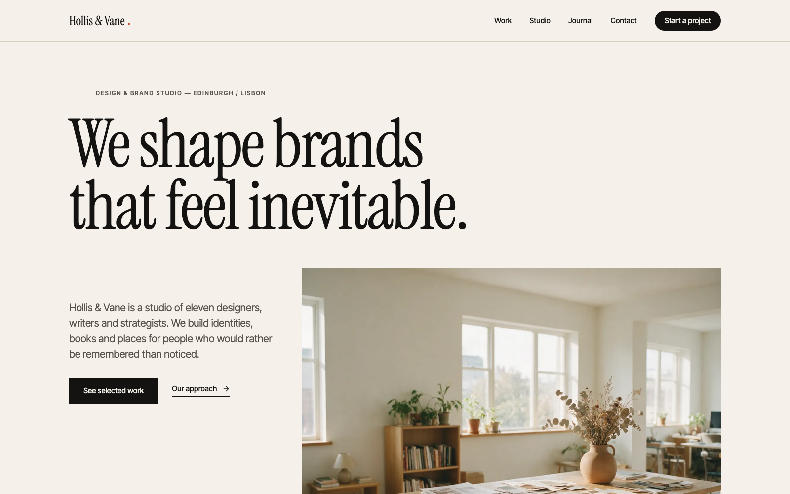
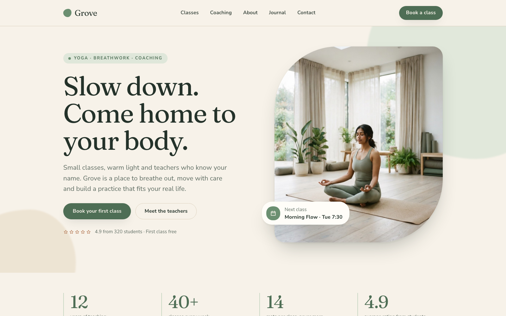
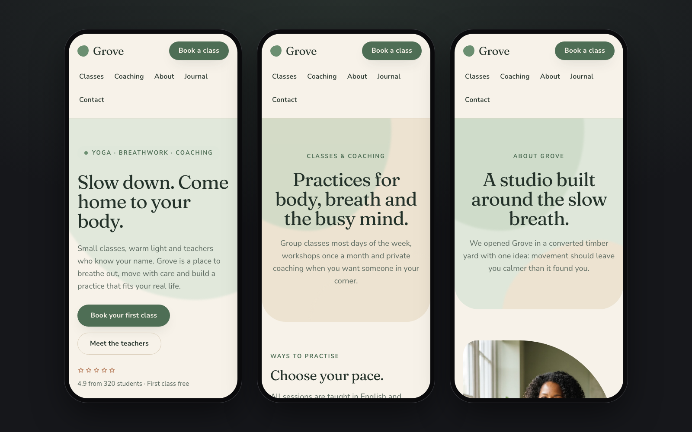
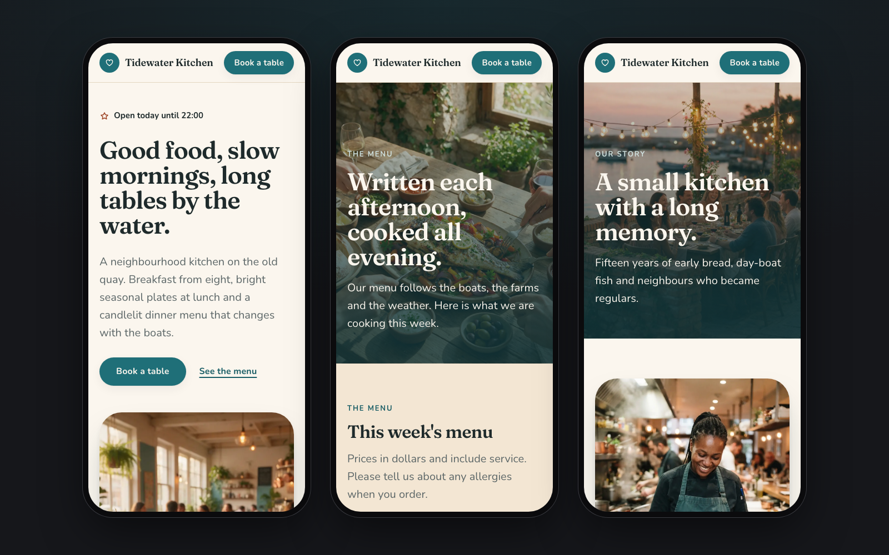
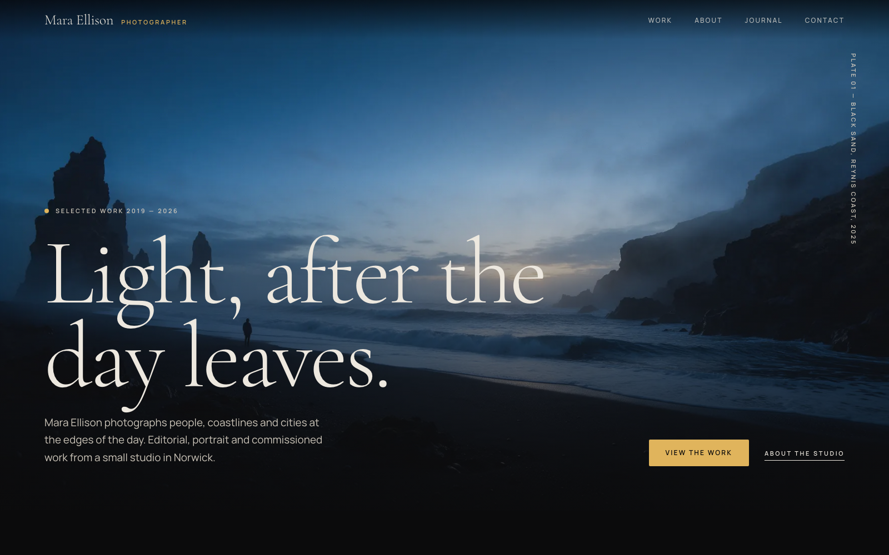
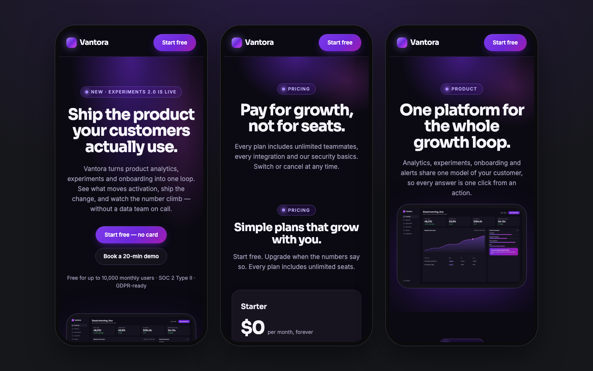
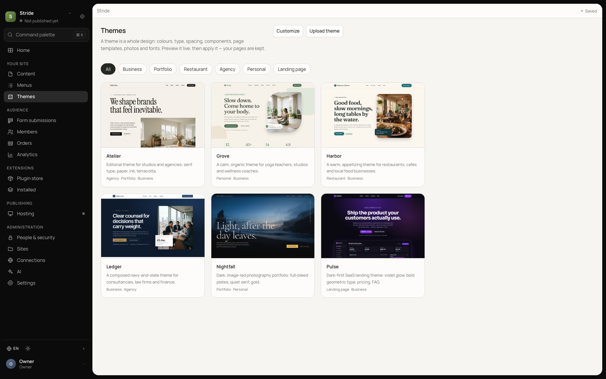
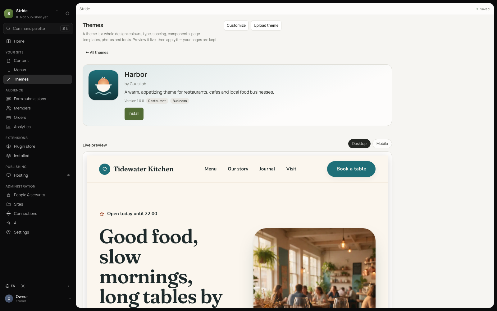
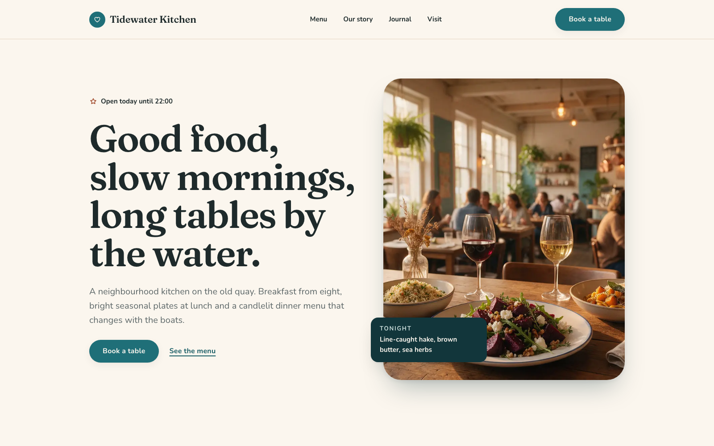

# Stride Themes

The official theme store for [Stride](https://github.com/GuusLab/Stride). A theme is a whole
design for a Stride site: design tokens (colours, type, spacing, corners, shadows), a component
library, page templates, photographs and fonts.

**Browse the store:** https://guuslab.github.io/stride-themes

## The themes

|      | Theme | Home | On a phone |
| ---- | ----- | ---- | ---------- |
|  | **[Atelier](themes/atelier)**<br>Editorial theme for studios and agencies: serif type, paper, ink, terracotta.<br><sub>agency · portfolio · business</sub> | <a href="themes/atelier/screenshots/01.png"></a> | <a href="themes/atelier/screenshots/04.png"></a> |
|  | **[Grove](themes/grove)**<br>A calm, organic theme for yoga teachers, studios and wellness coaches.<br><sub>personal · business</sub> | <a href="themes/grove/screenshots/01.png"></a> | <a href="themes/grove/screenshots/04.png"></a> |
|  | **[Harbor](themes/harbor)**<br>A warm, appetizing theme for restaurants, cafes and local food businesses.<br><sub>restaurant · business</sub> | <a href="themes/harbor/screenshots/01.png"></a> | <a href="themes/harbor/screenshots/04.png"></a> |
|  | **[Ledger](themes/ledger)**<br>A composed navy-and-slate theme for consultancies, law firms and finance.<br><sub>business · agency</sub> | <a href="themes/ledger/screenshots/01.png"></a> | <a href="themes/ledger/screenshots/04.png"></a> |
|  | **[Nightfall](themes/nightfall)**<br>Dark, image-led photography portfolio: full-bleed plates, quiet serif, gold.<br><sub>portfolio · personal</sub> | <a href="themes/nightfall/screenshots/01.png"></a> | <a href="themes/nightfall/screenshots/04.png"></a> |
|  | **[Pulse](themes/pulse)**<br>Dark-first SaaS landing theme: violet glow, bold geometric type, pricing, FAQ.<br><sub>landing · business</sub> | <a href="themes/pulse/screenshots/01.png"></a> | <a href="themes/pulse/screenshots/04.png"></a> |

Every screenshot is taken from a real Stride: the theme is uploaded, applied with a new home
page, and its pages are published (see [`tools/shoot.mjs`](tools/shoot.mjs)).

## Installing a theme

In Stride, open **Admin → Themes**. The store lists these themes from the signed index at
`https://guuslab.github.io/stride-themes/index.json`. Pick one to see its screenshots, then:

1. **Install** — the server downloads the zip itself, checks its size, SHA-256 and Ed25519
   signature against the built-in themes key, and validates every file against Stride's own types.
2. **Preview** — look at your own pages in the theme before anything is saved.
3. **Apply** — sets the site's tokens, adds the theme's components to the library, uploads its
   images to Media and, if you choose, creates a new home page from the theme's home template.
   Existing pages are never changed or deleted, and **Undo** puts the previous tokens back.

The other templates show up under **New page** in the editor.

Themes need a Stride built with the `themes` feature (`--features plugins` turns it on).

<p>
  
  
</p>

After applying Harbor with a new home page and publishing it, the site's home page:



## Making a theme

The package format, validation rules and actions are documented in Stride's
[`docs/themes.md`](https://github.com/GuusLab/Stride/blob/main/docs/themes.md). In short:

```text
themes/<id>/
  theme.json            id, name, version, tagline, categories, accent, fonts, homeTemplate …
  tokens.json           the TokenSet that tokens.get returns
  components/*.json     component masters, as components.get returns them
  templates/<slug>.json Documents; home, about, contact, 404 and blog-index or services
  assets/images/*       .jpg / .webp / .png, at most 350 KB each
  assets/fonts/*.woff2
  icon.png              512 x 512
  screenshots/NN.png    1600 x 1000, two to five
```

Check a theme with `stride theme validate themes/<id>`. To take its screenshots:

```sh
npm ci
tools/demo-server.sh 8960 .demo/<id>          # a throwaway Stride with a fresh database
node tools/shoot.mjs <id> http://127.0.0.1:8960 <template-a> <template-b>
kill $(cat .demo/<id>/stride.pid)
```

`tools/icon.mjs` renders an `icon.svg` to the 512 x 512 `icon.png`.

## Publishing

```sh
stride theme index . --key ~/.stride/stride-themes.key \
  --base-url https://guuslab.github.io/stride-themes
python3 tools/gallery.py      # site/index.html
python3 tools/check.py        # what CI checks
```

`stride theme index` validates every theme, zips each one reproducibly into
`site/themes/<id>/<version>/theme.zip`, copies icons and screenshots, and writes the signed
`site/index.json`. A published version is immutable: change a theme, bump its version. Pushing
`main` deploys `site/` to GitHub Pages.

The private key never leaves the maintainer's machine. The index is signed with the themes
registry key

```text
c7aae1439b9c52db5b0520ae68d2b1d34364ab56415a13e30bec4d007860310f
```

which is built into Stride as the default trusted themes key.

## Licence

Code and JSON are MIT. Fonts are under the SIL Open Font License 1.1, and the photographs are
original images made for these themes; see [LICENSE](LICENSE) and each theme's README.
